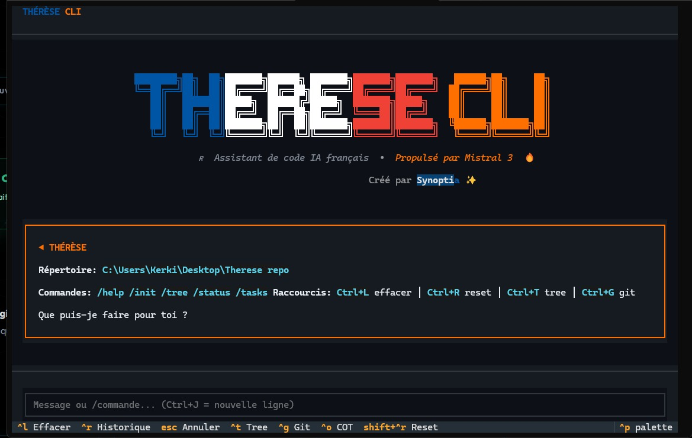

<p align="center">
  
</p>

<p align="center">
  <strong>itylos — Messagerie éphémère souveraine en CLI</strong>
</p>

<p align="center">
  <a href="https://opensource.org/licenses/MIT"></a>
  <a href="https://github.com/kerk99/itylos-cli/releases"></a>
  <a href="https://crates.io/crates/itylos-cli"></a>
</p>

<p align="center">
  <a href="#installation">Installation</a> &bull;
  <a href="#utilisation">Utilisation</a> &bull;
  <a href="#modèle-de-sécurité">Sécurité</a> &bull;
  <a href="#contrat-api">API</a> &bull;
  <a href="#architecture">Architecture</a>
</p>

---

<p align="center">
  
</p>

Chiffrement local AES-256-GCM. Clé de déchiffrement qui ne quitte jamais la machine. Partage de liens éphémères zero-knowledge. Destruction burn-on-read avec preuve Ed25519. Un seul binaire Rust nommé `itylos`.

## Le Principe

```
                    ┌──────────┐
    "secret"   ───▶ │  itylos  │ ──▶  AES-256-GCM (local)
                    └──────────┘
                         │
                         ▼
              payload chiffré ──▶ serveur (ne voit que du bruit)
              clé (#...) ──▶ reste dans l'URL fragment (jamais envoyée)
                         │
                         ▼
              lecture ──▶ déchiffrement local ──▶ destruction serveur
                                                  + preuve Ed25519
```

Le serveur ne reçoit **jamais** la clé. Le texte en clair n'existe que sur la machine de l'expéditeur et celle du destinataire.

## Installation

### Binaires pré-compilés (recommandé)

Télécharger depuis [Releases](https://github.com/kerk99/itylos-cli/releases) :

| Plateforme | Fichier |
|------------|---------|
| macOS (Apple Silicon) | `itylos-aarch64-apple-darwin.tar.gz` |
| macOS (Intel) | `itylos-x86_64-apple-darwin.tar.gz` |
| Linux (x64) | `itylos-x86_64-unknown-linux-musl.tar.gz` |
| Linux (ARM64) | `itylos-aarch64-unknown-linux-gnu.tar.gz` |
| Windows (x64) | `itylos-x86_64-pc-windows-msvc.zip` |

```bash
# Linux/macOS :
tar -xzf itylos-x86_64-unknown-linux-musl.tar.gz
sudo mv itylos /usr/local/bin/

# Windows : extraire le zip, ajouter itylos.exe au PATH
```

### Script d'installation automatique

```bash
# Linux/macOS
curl -fsSL https://raw.githubusercontent.com/kerk99/itylos-cli/main/scripts/install.sh | sh

# Windows (PowerShell)
irm https://raw.githubusercontent.com/kerk99/itylos-cli/main/scripts/install.ps1 | iex
```

### Depuis les sources (Rust 1.85+)

```bash
cargo install --git https://github.com/kerk99/itylos-cli
```

### Vérification

```bash
itylos --version
itylos --help
```

## Utilisation

### Envoyer un secret

```bash
itylos send "mon secret"
itylos send -f document.pdf -d 24h
itylos send "message" -f fichier.zip -d 7j
itylos send "secret" -p                    # Proteger avec un mot de passe
itylos send -f confidentiel.pdf -d 24h -p  # Fichier + mot de passe
```

Durées disponibles : `1h` (défaut), `24h`, `7j`

Le flag `-p` / `--password` demande un mot de passe interactif avec confirmation. Le destinataire devra saisir le même mot de passe pour déchiffrer la capsule.

### Lire et détruire une capsule

```bash
itylos read https://itylos.com/v/<id>#<clé>
```

Le CLI déchiffre localement, affiche le contenu, extrait les pièces jointes, puis demande la destruction côté serveur.

### Vérifier une preuve de destruction

```bash
itylos verify proof.json
```

Authentifie cryptographiquement (Ed25519) qu'une capsule a bien été détruite par ITYLOS.

### Serveur MCP (intégration IA)

```bash
itylos mcp
```

Expose l'outil `itylos_create_capsule` via le protocole JSON-RPC stdio pour Claude, Cursor, et autres assistants IA.

## Modèle de Sécurité

| Propriété | Implémentation |
|-----------|---------------|
| **Zero-knowledge** | Le serveur ne reçoit jamais la clé — elle reste dans le fragment URL (`#key`) |
| **Chiffrement local** | Le texte en clair est sérialisé et chiffré avant tout envoi réseau |
| **AAD lié au TTL** | Le TTL participe au chiffrement authentifié (AAD) — modifier le TTL invalide le déchiffrement |
| **Zéroisation** | Les buffers sensibles (clés dérivées, plaintext) sont effacés en mémoire avec `zeroize` |
| **Preuve de destruction** | Les preuves sont normalisées et vérifiées avec Ed25519 |
| **Anti traffic-analysis** | Le payload est paddé par paliers (1024/10240/+512) avec du bruit aléatoire |
| **Protection par mot de passe** | Double couche optionnelle : PBKDF2-HMAC-SHA256 (300k itérations) combinée avec la clé URL |

### Processus cryptographique

**Sans mot de passe :**

1. **Clé locale** : 32 octets CSPRNG → encodée en base64url (fragment `#key`)
2. **Dérivation** : `SHA-256(url_key)` → clé AES 256 bits
3. **Chiffrement** : AES-256-GCM avec nonce 12 octets aléatoire
4. **AAD** : `{"v":"2.0","alg":"AES-256-GCM","ttl":<seconds>}`
5. **Hash serveur** : `SHA-256(aad_bytes)` encodé en hex
6. **Payload** : `base64url(ciphertext).base64url(nonce)`

**Avec mot de passe (`-p`) :**

1. Étapes 1-2 identiques (génération de `url_key`)
2. **Salt** : 16 octets CSPRNG → encodé en base64url, envoyé au serveur dans `pwd_salt`
3. **Dérivation password** : `PBKDF2-HMAC-SHA256(password, salt, 300000)` → 32 octets
4. **Clé finale** : `SHA-256(url_key || pwd_key)` → clé AES 256 bits
5. Le reste est identique (AES-256-GCM, AAD, padding)

Compatible avec le frontend web (même algorithme dans `crypto.js`).

## Contrat API

Le CLI communique avec `https://itylos.com/api/v2/` :

| Endpoint | Méthode | Description |
|----------|---------|-------------|
| `/api/v2/create_secret` | POST | Crée une capsule chiffrée |
| `/api/v2/fetch_secret` | GET | Récupère le payload chiffré |
| `/api/v2/burn_secret` | POST | Détruit la capsule et génère une preuve |

### Validations côté client

- `payload` : format `base64url.base64url` (ciphertext.nonce)
- `ttl` : whitelist stricte (`3600`, `86400`, `604800`)
- `aad_hash` : hex-64, cohérent avec `SHA-256(AAD)`
- `has_password` / `pwd_salt` : paire cohérente
- `secret_id` : hex-32
- Noms de fichiers : sanitizés contre le path traversal
- Taille max : 8 Mo par pièce jointe

## Architecture

```
src/
├── main.rs          Entrypoint minimal, run() → anyhow::Result<()>
├── cli.rs           Parsing clap derive : send, read, verify, mcp
├── services.rs      Orchestration des use cases utilisateur
├── crypto/mod.rs    AES-256-GCM, AAD, padding, vérification Ed25519
├── network/mod.rs   Client HTTP reqwest/rustls vers /api/v2/*
├── types.rs         Structs serde, constantes, TTL enum
├── error.rs         Enum ItylosError (thiserror, 7 variantes)
├── ui.rs            Bannière, messages, rendu terminal
└── mcp/mod.rs       Serveur MCP JSON-RPC stdio
```

Architecture inspirée de [ai-rsk](https://github.com/Krigsexe/ai-rsk) : `main` minimal, séparation stricte des concerns, types centralisés, profil release déterministe (`lto`, `strip`, `codegen-units = 1`, `panic = "abort"`).

## Quality Gates

```bash
cargo fmt --check
cargo clippy --all-targets --all-features -- -D warnings
cargo test
cargo build --release
```

CI GitHub Actions multi-plateforme (Ubuntu, macOS, Windows) avec release automatique sur tags `v*`.

## Tests

30 tests unitaires couvrant :

- Parsing CLI (sous-commandes, flags, help/version)
- Crypto roundtrip (encrypt → decrypt → plaintext identique)
- Cohérence AAD hash avec le contrat
- Rejet TTL incorrect, payload malformé, nonce invalide
- Vérification de preuves (signées, non signées, malformées)
- Validation du contrat API (payload, TTL, aad_hash, password pair)
- Sanitization des noms de fichiers (anti path traversal)
- Rendu des capsules (V3 multi-attachment, fallback texte)
- Roundtrip chiffrement/déchiffrement avec mot de passe (bon mot de passe, mauvais, absent)

## License

MIT — [kachouri.com](https://kachouri.com)
